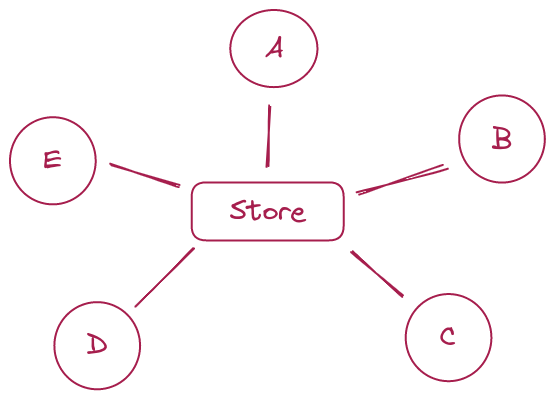

# di-react-redux

As a frontend developer, I have one most painful side in React everyday life. 
This issue often comes up in casual conversations or job interviews so, I understand, 
it is a burning question for many developers.

I'm going to focus on the problem associated with the common practice of using a 
state manager in React applications - not about any specific state-manager, but about approaches of its usages.

Okay, lets start from considering arbitrary React app diagram.

We have a store and five red components uses it - A, B, C, D and E. Every red component has direct access to store,
for example - hooks `useReducer` or `useSelector` in case of Redux. It is not important which state manager you use
here - it's important that components uses information about store's inner structure (for any data it has to know whrere
exactly it is stored)

Additional information - A and B related with same logic, and it's completely independent of C, D, E - works with 
different interface elements and different store fields etc. (it's important detail that is not clear from the diagram).

What's wrong with this app?
* it is hard to understand which components are related by business logic, and which in are independent, for example -
 there is no information about D and E components, they are not self-documented
* all components have shared state - if you work with one of them, you can create bug in any other 
* as above, to test any component you have to write test scenario, mocks for store and expected store state - 
too much store for component's test with other responsibility (even you don't write tests - component testability is 
 one of code quality metrics)
* onboarding of new team member takes more time - to work with any component you have to know all about store and
how other components uses it. You can't localize your work and can't onboard in codebase part by part.
* you cannot reuse your components - the C component can work with specific paths in store, the needs to get the similar
view often leads to code duplication of C, D and E components. 
have 

Why this happened?
Consider another picture - a diagram of connected components and look at it from the point
of view of [coupling](https://en.wikipedia.org/wiki/Coupling_(computer_programming)) and 
[cohesion](https://en.wikipedia.org/wiki/Cohesion_(computer_science)).

To put it simply, the coupling is metric that refers to how much different modules of a system rely on each other, 
cohesion - refers to how closely related and focused the elements within a module are. Low coupling and high cohesion
are better in software because they make the code easier to work with and reduce the chances of unintended consequences 
when making changes.

What we have here? The picture looks very simple - with only six components but:
* there is no modules in code (remember, A and B related in business-logic) - all components are piled together
* every component knows about store structure

And it's ok, the component's independence and unidirectional data flow in React allows us to live with the worst structure
store usage. The cost - mo bugs, more code, fragile development and long onboarding.

How to fix it?

All the troubles we have in example is result of violation of on of SOLID principles - dependency inversion.

