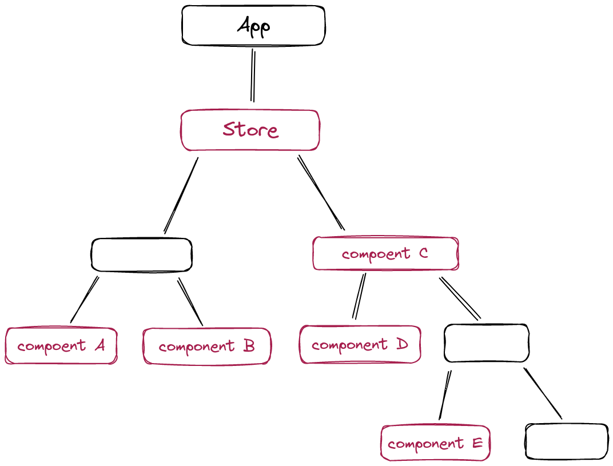
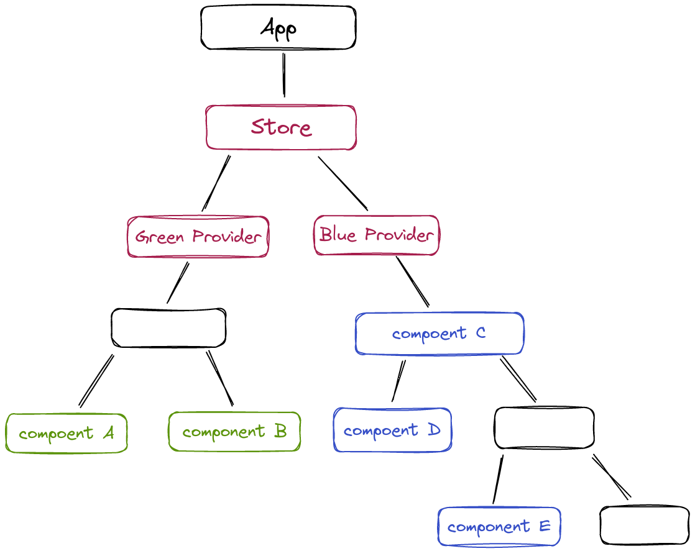
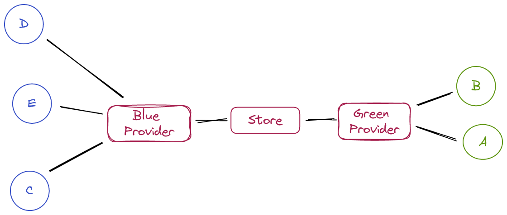

# di-react-redux

As a frontend developer, I have one most painful side in React everyday life. 
This issue often comes up in casual conversations or job interviews so, I understand, 
it is a burning question for many developers.

I'm going to focus on the problem associated with the common practice of using a 
state manager in React applications - not about any specific state-manager, but about approaches of its usages.

## Average React state-management app troubles

Okay, lets start from considering arbitrary React app diagram.

We have a store and five red components uses it - A, B, C, D and E. Every red component has direct access to store,
for example - hooks `useReducer` or `useSelector` in case of Redux. It is not important which state manager you use
here - it's important that components uses information about store's inner structure (for any data it has to know where
exactly it is stored)

Additional information - A and B related with same logic, and it's completely independent of C, D, E - works with 
different interface elements and different store fields etc. (it's important detail that is not clear from the diagram).

What's wrong with this app?
* it is hard to understand which components are related by business logic, and which in are independent, for example -
 there is no information about D and E components (of course, you can find all paths in store they use and compare), 
they are not self-documented
* all components have shared state - if you work with one of them, you can create bug in any other 
* as above, to test any component you have to write test scenario, mocks for store and expected store state - 
too much store for component's test with other responsibility (even you don't write tests - component testability is 
 one of code quality metrics)
* onboarding of new team member takes more time - to work with any component you have to know all about store and
how other components uses it. You can't localize your work and can't onboard in codebase part by part.
* you cannot reuse your components - the C component can work with concrete paths in store, the needs to get the similar
view often leads to code duplication of C, D and E components. 
have 

Why this happened?
Consider another picture - a diagram of connected components and look at it from the point
of view of [coupling](https://en.wikipedia.org/wiki/Coupling_(computer_programming)) and 
[cohesion](https://en.wikipedia.org/wiki/Cohesion_(computer_science)).

To put it simply, the coupling is metric that refers to how much different modules of a system rely on each other, 
cohesion - refers to how closely related and focused the elements within a module are. Low coupling and high cohesion
are better in software because they make the code easier to work with and reduce the chances of unintended consequences 
when making changes.

What we have here? The picture looks very simple - with only six components but:
* there is no modules in code (remember, A and B related in business-logic) - all components are piled together
* every component knows about store structure

And it's ok, the component's independence and unidirectional data flow in React allows us to live with the worst structure
store usage. The cost - mo bugs, more code, fragile development and long onboarding.

## How to fix it?

### Theoretically 
The issues in the example are caused by a violation of the Dependency Inversion principle, which can be summarized 
as follows:

* High-level modules should not depend on low-level modules. Both should depend on abstractions.
* Abstractions should not depend on implementations. Implementations should depend on abstractions.

When a component directly accesses the store, it depends on the specific implementation of the store, including its 
paths and data. To address this, we need to make the component dependent only on abstractions and create a special 
way for the store to realize these abstractions.

### In practice

In other frameworks such as Ninject for .NET or Angular (lets you get a feel for how DI works), a DI container is
operates and replaces interfaces with class realizations during compile time.
How to make it in React way - without classical compilation?

[React Context](https://react.dev/learn/passing-data-deeply-with-context) allows us to provide a value to a
component tree without having to pass it down through every level of the tree - it can be used in conjunction with 
other techniques to create a simple form of DI container.
We will use the context object as dependency marker (instead of interface) to resolving dependency inside container.
`useContext` hook or `Context.Consumer` can be used to require realization through the context, while `Context.
Provider` can create a container for it.

To simplify component-store relationships, we will adopt a straightforward approach. Components that use the store will
require it as a specific abstraction based on business logic. For example, we can add two providers in the picture 
below, one for data used by A and B components and another for data used by C, D, and E components. The providers have 
direct access to the store, and therefore are colored red, while the other components are colored based on the 
corresponding provider.

What we got now:
* separating components into independent green and blue groups, technical level dependencies between components are 
minimized and the risk of bugs is reduced (we almost exclude this kind of bugs)
* writing tests for these components is simplified, as they don't rely on any store knowledge
* these components can be easily reused with different data by changing the realization on the provider level
* this approach makes it easier to onboard new team members since they can understand and work on each module separately
*  by analyzing the abstraction level used in components, it's easier to understand whether they are related or not

The diagram of relations doesn't require any comments

